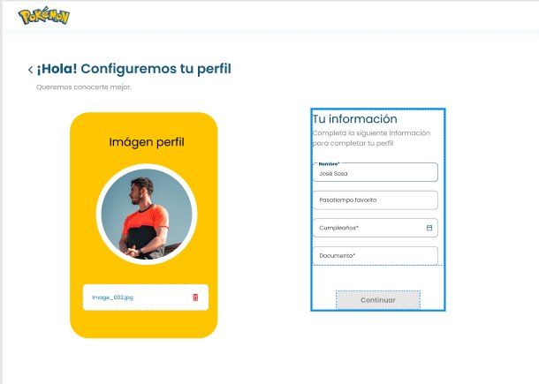
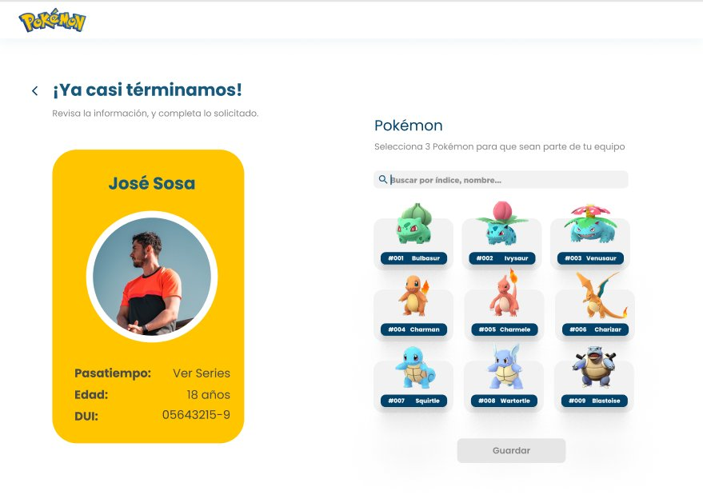
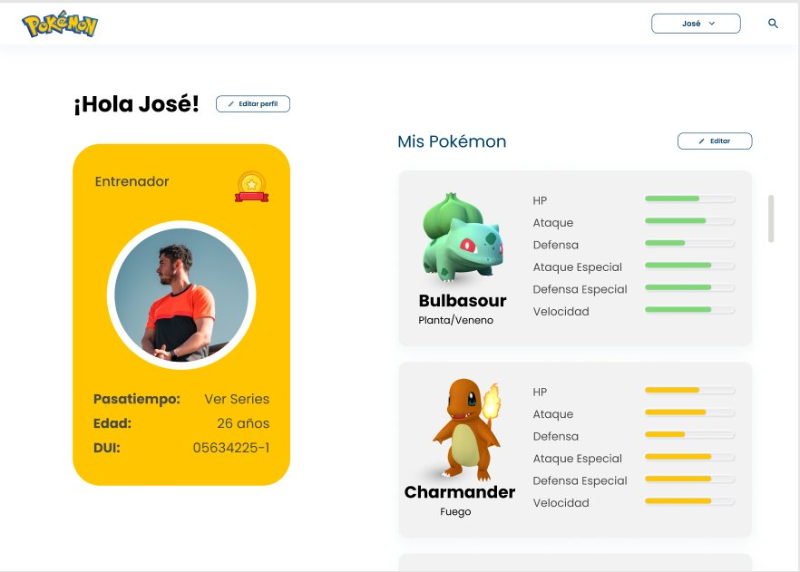

# Pokémon Trainer App

A single-page application that allow users to create a Pokémon Trainer profile and assemble their Generation 1 team, built with **Angular 20**, **Signals**, and **Tailwind CSS**.

---

## Screenshots

### Step 1 — Trainer Profile Setup
Configure your trainer identity: upload a photo by clicking on the avatar input, enter your name, favorite hobby, date of birth, and DUI (auto-formatted) or minor ID card based on your age.



---

### Step 2 — Pokémon Team Selection
Browse all Pokémon with real-time search by name or ID. Select exactly 3 to form your team. Sprites load progressively in chunks to avoid API rate limits.



---

### Step 3 — Trainer Card & Team Stats
View your complete trainer card alongside your Pokémon team. Each Pokémon shows its sprite, type badges, and stat progress bars (HP, ATK, DEF, SP.ATK, SP.DEF, SPD) relative to their Generation 1 maximums.




## Architecture

```
📦poke-trainer
 ┣ 📂docs
 ┃ ┗ 📂screenshots
 ┃ ┃ ┣ 📜step1-trainer-form.png
 ┃ ┃ ┣ 📜step2-pokemon-selection.png
 ┃ ┃ ┗ 📜step3-profile.png
 ┣ 📂node_modules
 ┣ 📂public
 ┃ ┗ 📜poke-trainer.ico
 ┣ 📂src
 ┃ ┣ 📂app
 ┃ ┃ ┣ 📂core
 ┃ ┃ ┃ ┣ 📂guards
 ┃ ┃ ┃ ┃ ┗ 📜trainer.guard.ts
 ┃ ┃ ┃ ┣ 📂models
 ┃ ┃ ┃ ┃ ┣ 📜pokemon.model.ts
 ┃ ┃ ┃ ┃ ┗ 📜trainer.model.ts
 ┃ ┃ ┃ ┗ 📂services
 ┃ ┃ ┃ ┃ ┣ 📜pokemon.service.ts
 ┃ ┃ ┃ ┃ ┣ 📜storage.service.ts
 ┃ ┃ ┃ ┃ ┗ 📜trainer.service.ts
 ┃ ┃ ┣ 📂features
 ┃ ┃ ┃ ┣ 📂pokemon
 ┃ ┃ ┃ ┃ ┣ 📂components
 ┃ ┃ ┃ ┃ ┃ ┣ 📜poke-card.component.html
 ┃ ┃ ┃ ┃ ┃ ┗ 📜poke-card.component.ts
 ┃ ┃ ┃ ┃ ┗ 📂pages
 ┃ ┃ ┃ ┃ ┃ ┣ 📜pokemon-page.component.html
 ┃ ┃ ┃ ┃ ┃ ┗ 📜pokemon-page.component.ts
 ┃ ┃ ┃ ┣ 📂profile
 ┃ ┃ ┃ ┃ ┣ 📂components
 ┃ ┃ ┃ ┃ ┃ ┣ 📜stats-bar.component.html
 ┃ ┃ ┃ ┃ ┃ ┗ 📜stats-bar.component.ts
 ┃ ┃ ┃ ┃ ┗ 📂pages
 ┃ ┃ ┃ ┃ ┃ ┣ 📜profile-page.component.html
 ┃ ┃ ┃ ┃ ┃ ┗ 📜profile-page.component.ts
 ┃ ┃ ┃ ┗ 📂trainer
 ┃ ┃ ┃ ┃ ┗ 📂pages
 ┃ ┃ ┃ ┃ ┃ ┣ 📜trainer-page.component.html
 ┃ ┃ ┃ ┃ ┃ ┗ 📜trainer-page.component.ts
 ┃ ┃ ┣ 📂shared
 ┃ ┃ ┃ ┣ 📂components
 ┃ ┃ ┃ ┃ ┣ 📂loading
 ┃ ┃ ┃ ┃ ┃ ┣ 📜loading.component.html
 ┃ ┃ ┃ ┃ ┃ ┗ 📜loading.component.ts
 ┃ ┃ ┃ ┃ ┗ 📂navbar
 ┃ ┃ ┃ ┃ ┃ ┣ 📜navbar.component.html
 ┃ ┃ ┃ ┃ ┃ ┗ 📜navbar.component.ts
 ┃ ┃ ┃ ┣ 📂directives
 ┃ ┃ ┃ ┃ ┗ 📜dui-mask.directive.ts
 ┃ ┃ ┃ ┗ 📂pipes
 ┃ ┃ ┃ ┃ ┗ 📜pokemon-search.pipe.ts
 ┃ ┃ ┣ 📜app.component.html
 ┃ ┃ ┣ 📜app.component.ts
 ┃ ┃ ┣ 📜app.config.ts
 ┃ ┃ ┗ 📜app.routes.ts
 ┃ ┣ 📂assets
 ┃ ┃ ┣ 📜loading.gif
 ┃ ┃ ┣ 📜poke-cursor.png
 ┃ ┃ ┣ 📜poke-pointer.png
 ┃ ┃ ┗ 📜pokemon-logo.png
 ┃ ┣ 📜index.html
 ┃ ┣ 📜main.ts
 ┃ ┗ 📜styles.css
 ┣ 📜.editorconfig
 ┣ 📜.gitignore
 ┣ 📜.postcssrc.json
 ┣ 📜angular.json
 ┣ 📜Dockerfile
 ┣ 📜nginx.conf
 ┣ 📜package-lock.json
 ┣ 📜package.json
 ┣ 📜README.md
 ┣ 📜tailwind.config.js
 ┣ 📜tsconfig.app.json
 ┣ 📜tsconfig.json
 ┗ 📜tsconfig.spec.json
```

Every component is **standalone** — no NgModules. State is managed entirely with **Angular Signals** (`signal`, `computed`, `input`, `output`). Routes use functional guards and lazy `loadComponent`.

---

## Getting Started

### Prerequisites

- Node.js >= 18
- Angular CLI >= 20

```bash
npm install -g @angular/cli
```

### Install & run

```bash
git clone https://github.com/BoroaDev7/PokeTrainer.git
cd poketrainer
npm install
npm start
```

App runs at **http://localhost:4200**

### Production build

```bash
npm run build:prod
# Output: dist/poketrainer/browser/
```

---

## Docker

```bash
# Build image
docker build -t poketrainer .

# Run container
docker run -p 8080:80 poketrainer
# http://localhost:8080
```

Multi-stage build: Angular compiles in Node 20 Alpine, output is served by nginx Alpine with SPA routing configured.


Commits and comments in **English** per project requirements.
